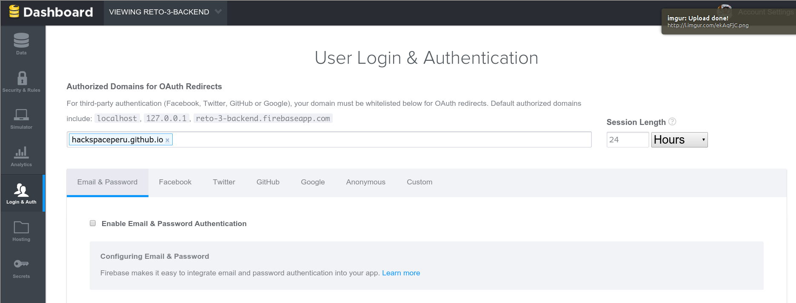
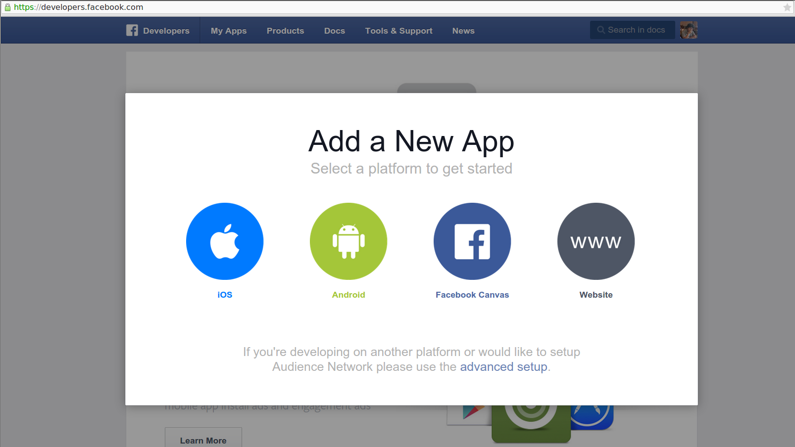
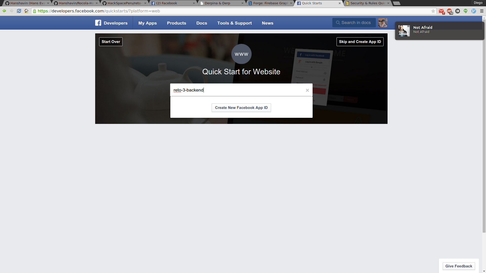
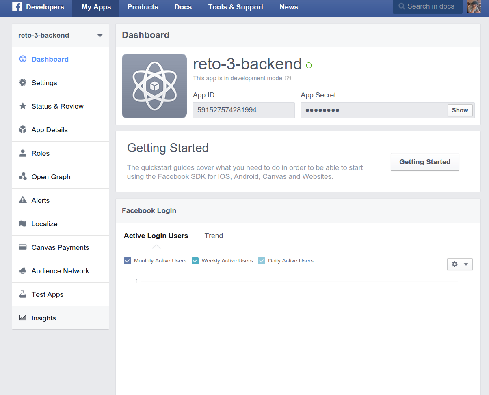
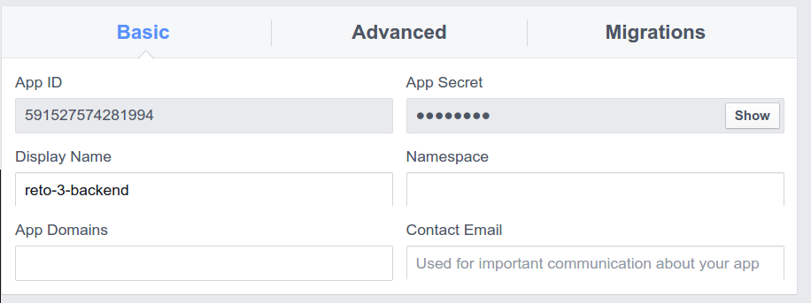
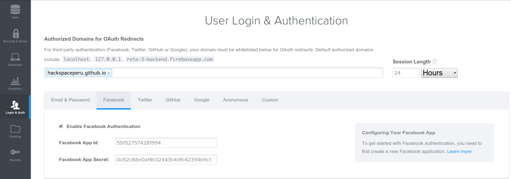
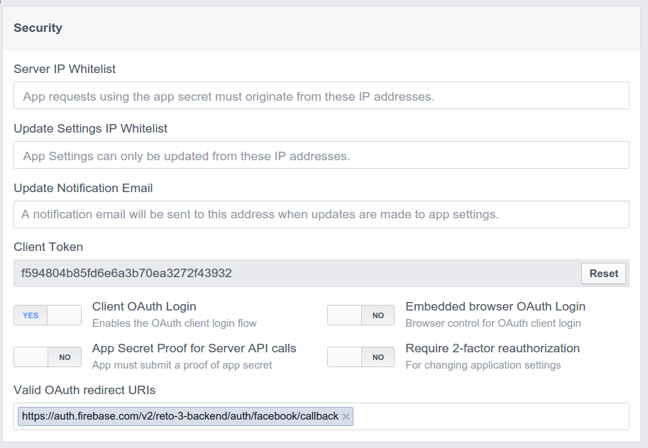
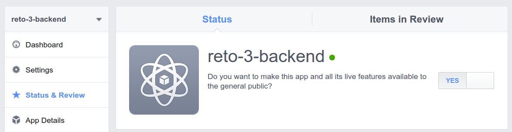
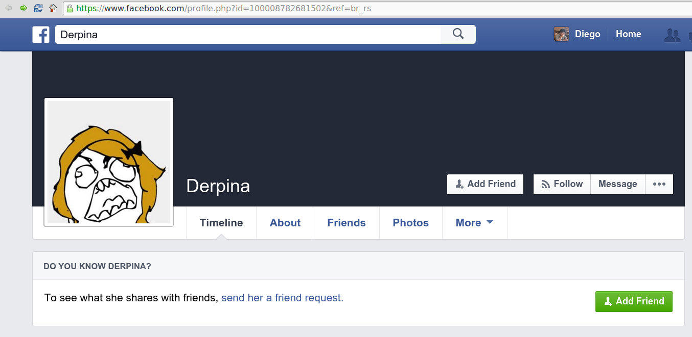

# Implementación de OAuth con Firebase

<!-- markdown-toc start - Don't edit this section. Run M-x markdown-toc/generate-toc again -->
**Table of Contents**

- [Implementación de OAuth con Firebase](#implementacin-de-oauth-con-firebase)
    - [Recapitulando](#recapitulando)
    - [Entregable](#entregable)
    - [Haciendo una página web para Manuel@ (O tu persona especial de elección)](#haciendo-una-pgina-web-para-manuel-o-tu-persona-especial-de-eleccin)
        - [Creando tu Firebase App](#creando-tu-firebase-app)
        - [Creando un Facebook App](#creando-un-facebook-app)
        - [CODING TIME](#coding-time)
        - [Conectando a Firebase](#conectando-a-firebase)
        - [Configurando el Login](#configurando-el-login)
        - [Limitando acceso sólo a Derpina](#limitando-acceso-slo-a-derpina)
    - [Palabras finales](#palabras-finales)

<!-- markdown-toc end -->
## Recapitulando

En el reto anterior al menos deben recordar como hacen la conexión con
firebase en el frontend de su página web, bueno ahora tendrán que
implementar por su cuenta la integración con Facebook y Twitter,
obviamente. Sólo explicaremos uno de ellos.

Pero de que sirve una autentificación si no haces nada al respecto,
normalmente se usa esto para saber la identidad del usuario y luego
tomar diversas decisiones acerca del status de este usuario en tu
plataforma o en tu página web (por ejemplo un autor, editor en un
blog, o un usuario premium o uno trial en un producto)

Sin embargo, ya que se acerca san valentin les explicare aqui como
haríaan para darle acceso SÓLO a una persona especial a su website,
esto servira como ejemplo para que luego ustedes puedan hacer sus
propias cosas para saber si un usuario es premium o no haciendo
queries basicos del id del usuario en su plataforma.

## Entregable

El reto es implementar OAuth en su página web, y tener dos tipos de
usuarios, unos premium y otros que no son premium. Y mostrar cosas
diferentes para cada uno. Basta con un mensaje de: Oye eres usuario
premium. La forma de como serán llenados los usuarios lo pueden hacer
como gusten, hardcodeando los ids de los usuarios en su archivo de js
que se importa en la pagina web, o usando una base de datos en
firebase con la estructura que tenían en el reto anterior. Tendrán que
entregar su proyecto en un zip como siempre entregaban sus proyectos
hasta ahora.

No es necesario tener mucha seguridad en este paso, sin embargo si
quieren saber la solución más segura, obviamente es la de tener una
base de datos en firebase y hacer queries a ella teniendo solo
permisos de lectura, más información en la [documentación](
https://www.firebase.com/docs/security/quickstart.html )

## Haciendo una página web para Manuel@ (O tu persona especial de elección)

### Creando tu Firebase App

Ya cubrieron esto en el reto anterior ahora sólo tendrán que tener en
cuenta que su app tiene que tener un dominio, al cual se harán las
cosas de OAuth, así que tendrán que configurar eso en Firebase.

Basta con poner el URL que usarán para su web en este campo, nosotros
estamos usando github-pages para este ejemplo así que se ve así:



Ojo que es muy importante tener el nombre de su firebase, porque paa
facebook tendremos que utilizar el siguiente callback

`https://auth.firebase.com/v2/<aquí el nombre de tu firebase>/auth/facebook/callback`

En nuestro caso:

`https://auth.firebase.com/v2/reto-3-backend/auth/facebook/callback`

### Creando un Facebook App 

Si vamos a hacer un login con fb primero tendremos que crear una app de FB para eso, así que van a la página de Facebook [Developers]( developers.facebook.com ) (developers.facebook.com) y le dan a crear nueva app. Como es su primera vez, los guiaré.

Tendrán esta vista, vayan a por Website


Luego ponganle el nombre de su nueva app



En la siguiente parte eligan una categoría y denle a Crear App ID.

Luego de esto le dan a Skip QuickStart o Saltar Inicio Rápido. Lo importante es que lleguen a esta página al final.



Ojo que este proceso puede variar en apariencia ya que facebook siempre está actualizando la plataforma para desarrolladores.

Aquí seleccionarán Settings (o Ajustes) en el dashboard.



Luego tendrán que llenarlo con la URL que usarán, poner un email de confirmación(para luego poder hacer su app pública y que no sólo la puedan usar ustedes).

En esta pantalla también tendrán que anotar su App ID y su App Secret,
porque tendrán que ingresarlo en firebase, en la misma ventana que
estaba antes. Así como en lo siguiente:



Ahora entren a opciones Avanzadas, y coloquen el callback en donde se debe:




Para que su app de facebook sea pública, tendrán que haber puesto su
correo en la pantalla de configuraciones básicas (Basic Settings). Si ya lo hicieron, entonces tendrán que ir a "Status & Review" en el dashboard de la izquierda y luego podrán tener un toggle para activar públicamente su aplicación de facebook. SI no pueden cambiar este toggle es porque no han puesto una dirección de correo válida.



Ya están listos para comenzar a usar OAuth en firebase

### CODING TIME

El ejemplo lo tienen arriba, pueden revisar reto.js y reto.css. Si
tienen dudas pueden revisar la documentación de [firebase](
https://www.firebase.com/docs/web/guide/login/facebook.html ).

### Conectando a Firebase

Primero hacen la conexión como siempre

`var ref = new Firebase("https://<tu app de firebase aquí>.firebaseio.com")`

Luego usando este objeto `ref` podremos recibir el resultado de una autentificación con OAuth.

``` js
ref.onAuth(function(authData) {
    if (authData) {
        // user authenticated with Firebase
        (...)
        (cosas que pasarán cuando estes logeado)

        // save the user 
        ref.child('users').child(authData.uid).set(authData);
        }
    else{
        // user is logged out
        (...)
        (cosas que pasarán cuando te deslogees)
        }
```

Por ahora sólo es necesario que entiendas la estructura general

### Configurando el Login

Ahora que ya tienen una idea de que pasa en el bucle de logeo, es hora
de llamar a la función de logeo, obviamente quieren que esto esté
ligado a alguna acción del usuario, como por ejemplo darle click al
botón de facebook. Nosotros tenemos configurado un overlay en nuestra
aplicación web que simplemente son trucos de html y css, pueden
checkear reto.css y index.html para más información sobre este overlay.
    


Usaremos JavaScript Puro para que funcione el botón de facebook.

```js
document.querySelector('.fa-facebook-square').addEventListener('click', function(){
    ref.authWithOAuthRedirect('facebook', function(err, authData){
        console.log(authData);
    });
});
```

Verán que en nuestro repo no está exactamente así, sino que hay una
abstracción de la función de userLogin. Es una pista para ver cómo
implementarían su logeo con twitter.

Ahora cada vez que den click en el botón de facebook les saltará la
ventana de logeo con facebook y si es exitosa, entonces el bucle
dentro de `if(authData)` se ejecutará, pueden tener lo que quieran
aquí, mostrar algo, redireccionar, poner el nombre del usuario en
algún lado, obtener su imágen de perfil, etc. No está implementado
aquí, pero ahí les dejamos las funciones que podrían usar para ello.

### Limitando acceso sólo a Derpina

Cuando un usuario se logea en tu página web, y se guarda en tu base de
datos de firebase, también se guardan cosas importantes para
reconocerlo en facebook, algo muy importante es su Facebook ID. Cuando
obtengas la authData de un usuario, esa información la encontrarás en
`authData.facebook.id` o `authData.twitter.id` acordemente.

Entonces tendremos que recapitular como darle acceso sólo a Derpina. Entramos al perfil de Derpina y vemos esto en la url:



`https://www.facebook.com/profile.php?id=100008782681502&sk=about`

De aquí es obvio ver que el id de derpina es `100008782681502`

Entonces vamos a hacer que si el Facebook ID de la persona logeada es
igual a este ID, que se muestre la página web, y si no es así...pues
te mostramos un mensaje de que no eres l@ indicad@.

Obviamente si quieres probarlo con tu propio facebook tendrás que
averiguar tu fb, y claro si quieres usar la página para alguien más
también tendrás que averiguar su FB ID pero eso es ahora tu trabajo.

## Palabras finales

Este ejemplo es bastante inseguro ya que podrías modificar las
variables en el mismo buscador, he incluso tener full accesos a tu
firebase. Se recomienda que lean el link de seguridad que se puso al
inicio para asegurar tu firebase. Ya vieron en el reto pasado como
hacer un sistema crud de usuarios, pueden entrar a ver la estructura
de su data en su cuenta de firebase.

Como `hint` para su reto de hacer que se reconozcan usuarios premium y
no premium podrían usar un arreglo en el código javaScript y validar
si el id del usuario está en ese arreglo, pero obviamente eso es muy
poco seguro ya que cualquiera puede modificar el arreglo, etnonces lo
que se recomienda es tener una base de datos en firebase de sólo
lectura y hacer llamadas a esa base de datos.

Éxitos en su reto, preguntas donde siempre las hacen. Pueden
preguntarle a @Diegor1901 en twitter. O @CestDiego en Github. Si
tienen dudas un poco más respecto a este código pueden abrir issues en
GitHub y estos tendrán preferencia al momento de elegir cuales serán
.
